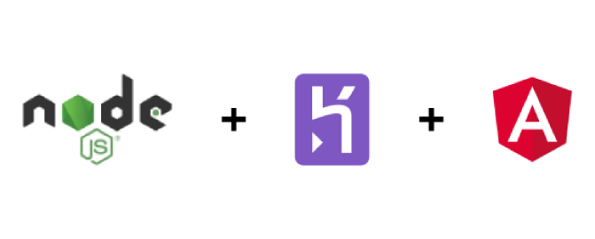

# Heroku Setup 101
## An Angular plus Node setup for Heroku
LIVE URL : https://heroku-setup101.herokuapp.com/

> Logos of Heroku, Angular and Node are Respective Logo owner's property.

<!-- 

     
 -->

<!-- **Table of Contents** -->

<!-- [TOCM]

# Table of Contents
1. [Example](## A Little Briefing)
2. [Example2](### Presenting, Angular plus Node setup for Heroku)
3. [Third Example](#third-example)

[TOC] -->

## A Little Briefing
### Presenting, Angular plus Node setup for Heroku

My Words on Heroku : 

Heroku is one simple Project infrastructure provider which gives everything as it is. 

- Code is deployed as it is. 

-  [mLab for MongoDB](https://www.mlab.com/home "mLab for MongoDB")  integration, which stores data as it is using commands or using Web interface (Unlike Firebase which asks you to fill Json without any MongoDB commands)
> To add a Database, Add ons are available on Heroku MarketPlace which gives you mLab

-  [Heroku Step-by-Step Documentation for project deployment ](https://devcenter.heroku.com/articles/getting-started-with-nodejs#set-up "Documentation for project deployment ") is quite simple and informative. It is enough to get you through

##### For other references, checkout some links here:
- ###### [Firebase or Heroku?](https://www.stackchief.com/blog/Firebase%20or%20Heroku%3F "Firebase or Heroku?")
- ###### [Why Heroku](http://tutorials.jumpstartlab.com/paths/elevate/why_heroku.html "Why Heroku")

## Ingredients

To get started, you can choose your own Angular-Node setup or Download this repo.

Setup Includes:

| FrontEnd  | Backend   | OS  | Platform  | Other Libraries  |
| ------------ | ------------ | ------------ | ------------ | ------------ |
|  Angular 5.2.1 | express 4.16.2   | Windows 8.1  | x64  | angular-bootstrap-md 5.1.2  |

##### You may also need
1. Git on local system
2. Heroku account 

## Getting Started
After downloading Repo, run `npm install` from root directory
To run project, type `ng serve -o` and you are good to go.

## Whats extra needed for Heroku setup
First of all, [Heroku Step-by-Step Documentation for project deployment ](https://devcenter.heroku.com/articles/getting-started-with-nodejs#set-up "Documentation for project deployment ") is quite simple and informative. It is enough to get you through, which asks a few things extra to do:

- A Proctfile,  (Save it with .js extension)
- A few commands to **SCALE THE APP** available [here](https://devcenter.heroku.com/articles/getting-started-with-nodejs#scale-the-app "here")

## Folder Structure

	|-Heroku-Setup
       ├── e2e                        # Compiled files (alternatively `dist`)
       ├── node_modules      #Which will be shown after running `npm install`
       ├── src                         # Source files (alternatively `lib` or `app`)
       ├── proctfile.js             # App runner script
       ├── Server.js                # Tools and utilities
       ├── package.json
       └── README.me
     
	 
## References
[Official Heroku Documentation](https://devcenter.heroku.com/articles/getting-started-with-nodejs "Official Heroku Documentation")

[MDbootstrap Official](https://mdbootstrap.com/ "MDbootstrap Official")

 [Firebase or Heroku?](https://www.stackchief.com/blog/Firebase%20or%20Heroku%3F "Firebase or Heroku?")
 
 [Why Heroku](http://tutorials.jumpstartlab.com/paths/elevate/why_heroku.html "Why Heroku")

## End
Feel free to open bugs. Its the only way to seek help from me
